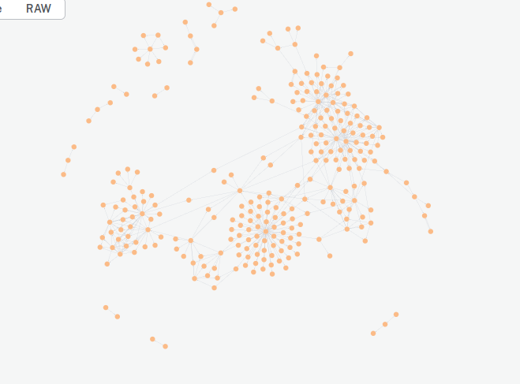

# Система анализа образовательного контента

## Описание

Данный проект представляет собой систему для автоматического анализа лекционных материалов с целью извлечения знаний и выявления пререквизитных связей между ними. Система использует методы обработки естественного языка и векторные представления текста для нахождения взаимосвязей между различными учебными материалами.

## Возможности

- Генерация векторных представлений (эмбеддингов) для текстов лекций
- Анализ семантической близости между различными учебными материалами
- Выявление пререквизитных связей между темами
- Визуализация связей между учебными материалами

## Визуализация

Для визуализации связей между учебными материалами используется библиотека NetworkX. Граф отображает пререквизитные связи между различными темами курса.



*Рисунок 1: Пример визуализации пререквизитных связей между темами курса.*

## Структура проекта

- `1generate_embeddings.py` - генерация векторных представлений для текстов
- `3find_connections.py` - поиск связей между материалами
- `4visualisation.py` - визуализация полученных связей

## Требования

- Python 3.8+
- Зависимости, перечисленные в файле `requirements.txt`

## Установка

1. Клонируйте репозиторий:
   ```bash
   git clone <repository-url>
   cd edu_parser
   ```

2. Создайте и активируйте виртуальное окружение:
   ```bash
   python -m venv venv
   source venv/bin/activate  # для Linux/Mac
   # или
   .\venv\Scripts\activate  # для Windows
   ```

3. Установите зависимости:
   ```bash
   pip install -r requirements.txt
   ```

## Использование

1. Подготовьте тексты лекций в соответствующем формате
2. Запустите генерацию эмбеддингов:
   ```bash
   python 1generate_embeddings.py
   ```
3. Выполните поиск связей:
   ```bash
   python 3find_connections.py
   ```
4. Визуализируйте результаты:
   ```bash
   python 4visualisation.py
   ```

## Лицензия

[Укажите лицензию, под которой распространяется проект]
